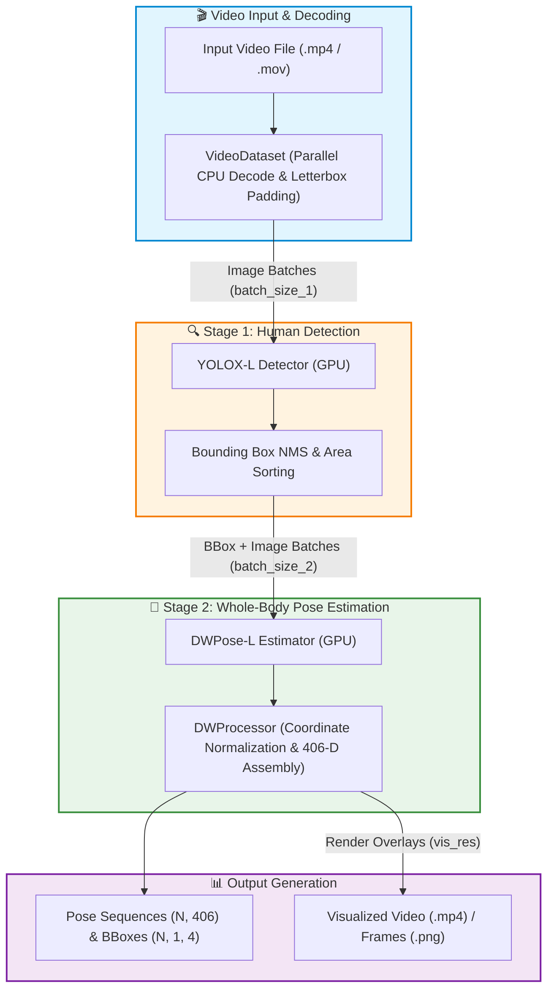

<div align="center">

# ⚡ DWPose Video Batch Inference

**High-throughput, multi-GPU batch inference pipeline for 2D Whole-Body Pose Estimation (133 Keypoints)**

[](https://www.python.org/) [](https://pytorch.org/) [](https://developer.nvidia.com/cuda-toolkit) [](https://github.com/open-mmlab/mmpose) [](https://github.com/open-mmlab/mmdetection) [](LICENSE)

<br/>

<p align="center">
  <em>Real-time, whole-body keypoint estimation (17 Body + 6 Feet + 68 Face + 42 Hands) for high-frame-rate videos.</em>
</p>

</div>

---

## 📑 Table of Contents
- [✨ Key Features](#-key-features)
- [🔄 Inference Architecture](#-inference-architecture)
- [📁 Project Structure](#-project-structure)
- [⚙️ Installation](#️-installation)
- [📥 Model Weights Download](#-model-weights-download)
- [🚀 Quick Start & Usage](#-quick-start--usage)
  - [Command-Line Interface (CLI)](#command-line-interface-cli)
  - [CLI Arguments Reference](#cli-arguments-reference)
  - [Python API Usage](#python-api-usage)
- [⚡ Hardware & Batch Sizing](#-hardware--batch-sizing)
- [📊 Output Specifications](#-output-specifications)
  - [1. Pose Sequence (N, 406)](#1-pose-sequence-n-406)
  - [2. Bounding Box (N, 1, 4)](#2-bounding-box-n-1-4)
  - [3. Video Metadata](#3-video-metadata)
- [📜 License & Acknowledgments](#-license--acknowledgments)

---

## ✨ Key Features

- **🚀 Maximized Batch Throughput**: Decoupled batching stages for human bounding box detection (**YOLOX**) and whole-body pose estimation (**DWPose**), delivering massive speedups over single-frame execution.
- **🧍 133 Whole-Body Keypoints**: Full COCO-WholeBody representation covering **17 body joints**, **6 foot points**, **68 facial landmarks**, and **42 hand keypoints**.
- **⚡ Multi-Process Video Decoding**: Automatic parallel CPU chunk decoding for long video clips (>4500 frames) with aspect-ratio preserving letterbox padding.
- **🎛️ Dynamic Downsampling & Trimming**: Built-in support for frame rate decimation (`extraction_ratio`) and duration clipping (`max_length`).
- **🎬 Flexible Visual Rendering**: Save rich animated skeleton overlays directly as `.mp4` video files or sequential high-resolution `.png` frames.

---

## 🔄 Inference Architecture



---

## 📁 Project Structure

```
DWPose-Video-Batch-Inference/
├── DWPose_usage/                        # DWPose & YOLOX inference package
│   ├── __init__.py                      # DWProcessor wrapper and skeleton drawing routines
│   ├── wholebody.py                     # Wholebody detector & pose estimation coordinator
│   ├── util.py                          # Rendering helpers (body, face, hand, foot) & math transforms
│   ├── inference_detector.py            # Batched human detector inference for MMDetection
│   ├── inference_topdown.py             # Batched top-down pose estimator inference for MMPose
│   ├── mmpose_inferencer.py             # MMPose inferencer adapter
│   ├── pose2d_inferencer.py             # 2D pose inferencer module
│   ├── dwpose_config/                   # DWPose configuration and checkpoint directory
│   │   ├── dwpose-l_384x288.py          # DWPose-L architecture configuration
│   │   └── dw-ll_ucoco_384.pth          # (Place DWPose checkpoint here)
│   └── yolox_config/                    # YOLOX detector configuration and checkpoint directory
│       ├── yolox_l_8xb8-300e_coco.py    # YOLOX-L detector configuration
│       └── yolox_l_8x8_300e_coco_...pth # (Place YOLOX checkpoint here)
├── video_pose_estimation.py             # Main batch inference script with CLI argument parser
├── LICENSE                              # License file
└── README.md                            # Project documentation
```

### Component Breakdown
- **[`video_pose_estimation.py`](video_pose_estimation.py)**: The main entry point. Contains `VideoDataset` (dataset handler with multi-threaded decoding and letterbox padding), `video_batch_inference()`, `video_pose_estimation()`, and the command-line interface with argument parsing (`parse_args`).
- **[`DWPose_usage/wholebody.py`](DWPose_usage/wholebody.py)**: The `Wholebody` class initializes the YOLOX human detector and DWPose pose estimator, extracts non-maximum suppressed (NMS) bounding boxes, and predicts whole-body keypoint coordinates.
- **[`DWPose_usage/__init__.py`](DWPose_usage/__init__.py)**: Contains `DWProcessor` which normalizes coordinates, builds the 406-dimensional pose sequence vectors, and handles pose rendering overlays.
- **[`DWPose_usage/util.py`](DWPose_usage/util.py)**: Mathematical utilities and specialized OpenCV drawing functions for limbs, facial landmarks, hands, and feet.
- **[`DWPose_usage/inference_detector.py`](DWPose_usage/inference_detector.py)** & **[`DWPose_usage/inference_topdown.py`](DWPose_usage/inference_topdown.py)**: Batched data pipeline forward wrappers for MMDetection and MMPose.

---

## ⚙️ Installation

### 1. Create and Activate Conda Environment
```bash
conda create --name dwpose python=3.8 -y
conda activate dwpose
```

### 2. Install PyTorch with CUDA Support
Install PyTorch matching your CUDA version (see [PyTorch Official Guide](https://pytorch.org/get-started/locally/)):
```bash
# Example for CUDA 11.8 / 12.1
pip install torch torchvision --index-url https://download.pytorch.org/whl/cu118
```

### 3. Install OpenMMLab Packages
```bash
pip install -U openmim
mim install mmengine
mim install "mmcv>=2.0.1"
mim install "mmdet>=3.1.0"
mim install "mmpose>=1.1.0"
pip install opencv-python Pillow matplotlib
```

> [!IMPORTANT]
> **Compatibility Version Patch**:
> If using MMCV >= 2.2.0, update the maximum version check in MMDetection:
> Open `<conda_path>/envs/dwpose/lib/python3.8/site-packages/mmdet/__init__.py` and modify:
> ```python
> # Change from:
> mmcv_maximum_version = '2.2.0'
> # To:
> mmcv_maximum_version = '2.2.1'
> ```

---

## 📥 Model Weights Download

Download the pretrained weights and place them into their respective directories:

| Model | Checkpoint File | Download Link | Target Destination |
| :--- | :--- | :--- | :--- |
| **YOLOX-L** | `yolox_l_8x8_300e_coco_20211126_140236-d3bd2b23.pth` | [Download (OpenMMLab)](https://download.openmmlab.com/mmdetection/v2.0/yolox/yolox_l_8x8_300e_coco/yolox_l_8x8_300e_coco_20211126_140236-d3bd2b23.pth) | `DWPose_usage/yolox_config/` |
| **DWPose-L** | `dw-ll_ucoco_384.pth` | [Download (HuggingFace)](https://huggingface.co/yzd-v/DWPose/blob/main/dw-ll_ucoco_384.pth) | `DWPose_usage/dwpose_config/` |

#### Quick Download Commands:
```bash
# Download YOLOX-L weights
wget -P DWPose_usage/yolox_config/ https://download.openmmlab.com/mmdetection/v2.0/yolox/yolox_l_8x8_300e_coco/yolox_l_8x8_300e_coco_20211126_140236-d3bd2b23.pth

# Download DWPose weights
wget -P DWPose_usage/dwpose_config/ https://huggingface.co/yzd-v/DWPose/resolve/main/dw-ll_ucoco_384.pth
```

---

## 🚀 Quick Start & Usage

### Command-Line Interface (CLI)

```bash
# 1. Basic pose estimation with video rendering
python video_pose_estimation.py --video_path ./demo_video.mp4 --save_to_video_path ./output/

# 2. Save both rendered video and individual frame images
python video_pose_estimation.py \
    --video_path ./demo_video.mp4 \
    --save_to_video_path ./output/ \
    --save_to_images_path ./output/frames/

# 3. High-throughput execution on NVIDIA RTX 4090 (24GB VRAM)
python video_pose_estimation.py -v ./demo_video.mp4 -sv ./output/ -b1 185 -b2 375

# 4. Frame downsampling (process 1 frame every 3 frames)
python video_pose_estimation.py -v ./demo_video.mp4 -sv ./output/ -r 3

# 5. Duration limit (process only first 15 seconds)
python video_pose_estimation.py -v ./demo_video.mp4 -sv ./output/ -m 15.0
```

---

### CLI Arguments Reference

| Argument | Short Flag | Type | Default | Description |
| :--- | :---: | :---: | :---: | :--- |
| `--video_path` | `-v` | `str` | `./blob_...mov` | Path to the input video file (e.g. `.mp4`, `.mov`, `.avi`). |
| `--save_to_video_path` | `-sv` | `str` | `./` | Directory path to save visualized video. Pass `""` or `'None'` to disable. |
| `--save_to_images_path` | `-si` | `str` | `None` | Directory path to save visualized frame images. Pass `None` to disable. |
| `--batch_size_1` | `-b1` | `int` | `185` | Batch size for human detection (YOLOX). |
| `--batch_size_2` | `-b2` | `int` | `375` | Batch size for whole-body pose estimation (DWPose). |
| `--extraction_ratio` | `-r` | `int` | `0` | Extraction ratio: `>1` extracts 1 every X frames; `<-1` extracts \|X\| frames per frame; `0` processes all frames. Cannot be `1`. |
| `--max_length` | `-m` | `float` | `0.0` | Maximum video duration in seconds to process (`0` processes full video). |

---

### Python API Usage

```python
from video_pose_estimation import video_pose_estimation

# Run batch pose estimation
pose_sequences, bboxes_list, video_meta = video_pose_estimation(
    video_path="path/to/your_video.mp4",
    save_to_video_path="./output/",         # Directory to save rendered video (or None)
    save_to_images_path="./output/frames/",  # Directory to save rendered frame images (or None)
    batch_size_1=185,                        # Detection batch size (YOLOX)
    batch_size_2=375,                        # Pose estimation batch size (DWPose)
    extraction_ratio=0,                      # 0 to process all frames
    max_length=0                             # 0 to process entire duration
)

# Inspect outputs
print("Total Frames Processed :", video_meta["frame"])
print("Video Resolution       :", f"{video_meta['W']}x{video_meta['H']}")
print("Pose Sequence Array Dim:", pose_sequences.shape)  # (N, 406)
print("Bounding Boxes Count   :", len(bboxes_list))      # N
```

---

## ⚡ Hardware & Batch Sizing

Optimize memory and GPU throughput by selecting appropriate batch sizes:

| GPU Model | VRAM | Detector Batch Size (`batch_size_1`) | Pose Estimator Batch Size (`batch_size_2`) |
| :--- | :---: | :---: | :---: |
| **NVIDIA A100** | 80 GB | `600` | `1220` |
| **NVIDIA RTX 4090** | 24 GB | `185` | `375` |
| **NVIDIA RTX 3090 / 4080** | 16–24 GB | `150` | `300` |
| **NVIDIA Tesla T4** | 16 GB | `115` | `240` |
| **NVIDIA RTX 3060 / 4060** | 8–12 GB | `50` | `100` |

---

## 📊 Output Specifications

### 1. Pose Sequence `(N, 406)`
For each frame $i \in [0, N-1]$, `pose_sequences[i]` is a 406-dimensional vector:

$$\text{Vector Length} = 7 + (133 \times 3) = 406$$

```
Index:  [0 ............. 6] [7 .................................... 405]
Data :  [ Bounding Box + Score ] [ 133 Keypoints: (x, y, confidence) x 133 ]
```

- **Bounding Box & Score (`Index 0 ~ 6`)**:
  - `[0, 0, x1, y1, x2, y2, score]`
  - `(x1, y1)`: Top-left coordinate of the detected person bounding box (in pixels).
  - `(x2, y2)`: Bottom-right coordinate of the detected person bounding box (in pixels).
  - `score`: Confidence score of the bounding box.

- **133 Whole-Body Keypoints (`Index 7 ~ 405`)**:
  - Each keypoint contains `[x_kpt, y_kpt, confidence_score]`.
  - Coordinates `(x_kpt, y_kpt)` are **normalized** to `[0.0, 1.0]` relative to frame width $W$ and height $H$.
  - Conversion to absolute pixel coordinates:
    $$X_{\text{pixel}} = x_{\text{kpt}} \times W, \quad Y_{\text{pixel}} = y_{\text{kpt}} \times H$$

<details>
<summary><b>🔍 Click to view Keypoint Index Partitions & COCO-WholeBody Mapping</b></summary>

| Keypoint Group | Keypoint Count | Array Index Range | Details |
| :--- | :---: | :---: | :--- |
| **Body Joints** | 17 | `7` ~ `57` | Nose, eyes, ears, shoulders, elbows, wrists, hips, knees, ankles |
| **Foot Points** | 6 | `58` ~ `75` | Big toe, small toe, heel (left & right) |
| **Face Landmarks** | 68 | `76` ~ `279` | Contour, eyebrows, nasal bridge, nose, eyes, mouth |
| **Hand Keypoints** | 42 | `280` ~ `405` | 21 keypoints for left hand + 21 keypoints for right hand |

For topology diagrams and details, refer to the [COCO-WholeBody Dataset Specification](https://github.com/jin-s13/COCO-WholeBody).
</details>

---

### 2. Bounding Box `(N, 1, 4)`
- List of length $N$, with each frame entry formatted as `[[x1, y1, x2, y2]]` in **absolute pixel coordinates**.

---

### 3. Video Metadata
```python
{
    "fps": 30,         # Video frames per second
    "frame": 450,      # Total processed frames
    "H": 640,          # Video height (pixels)
    "W": 640,          # Video width (pixels)
    "channel": 3,      # Color channels (BGR)
    "seconds": 15.0    # Processed duration in seconds
}
```

---

## 📜 License & Acknowledgments

This project is released under the Apache 2.0 License.

Special thanks and acknowledgment to the underlying open-source projects:
- [DWPose](https://github.com/IDEA-Research/DWPose) / [Effective Whole-body Pose Estimation with Two-stage Distillation](https://arxiv.org/abs/2307.15880)
- [MMPose](https://github.com/open-mmlab/mmpose) & [MMDetection](https://github.com/open-mmlab/mmdetection) by OpenMMLab
- [COCO-WholeBody](https://github.com/jin-s13/COCO-WholeBody)


